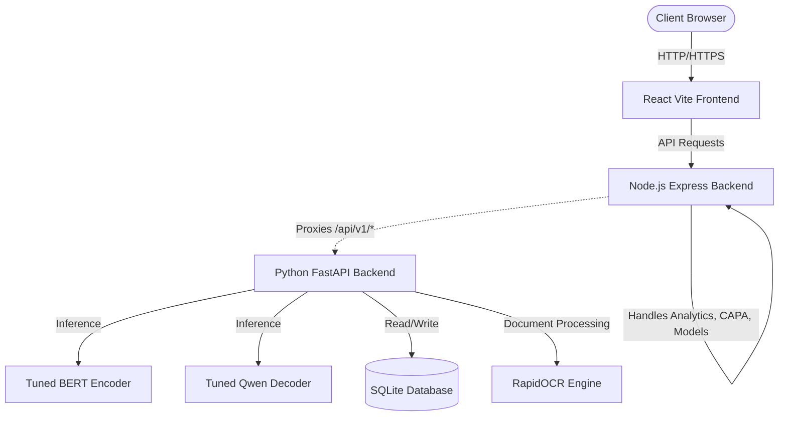

# SIF NLP Precursor

A full-stack, autonomous system for Serious Injury & Fatality (SIF) precursor detection using state-of-the-art natural language processing (NLP). 

This repository contains the complete stack: a React frontend, a Node.js management API, and a Python FastAPI service powering local ML inference and OCR capabilities.

## Architecture

The project employs a microservices-style architecture to separate the presentation layer, the data/management API, and the heavy machine learning workloads.



### Components:
- **Frontend (React/Vite)**: Located in `frontend/`. A modern UI for viewing reports, CAPA actions, ML analytics, and submitting documents for OCR/inference.
- **Node.js Backend (Express)**: Located in `backend/`. Handles API requests, orchestration, and proxies ML-specific requests (`/api/v1/*`) to the Python backend.
- **Python Backend (FastAPI)**: Located in the root directory. Manages the ML inference pipeline, PyTorch/Transformers dependencies, and the SQLite database.

## Quick Start (Development)

You can run the entire stack (Frontend, Node API, Python API, and a Localtunnel) concurrently using a single script.

```bash
# Install root dependencies
npm install

# Start the full stack
npm run dev:all
```

This starts:
1. **Frontend**: `http://localhost:5173`
2. **Node Backend**: `http://localhost:5000`
3. **Python Backend**: `http://localhost:8000`
4. **Tunnel**: Automatically exposes the Node backend via Localtunnel for remote/Vercel connectivity.

## Deployment (Hybrid Approach)

Due to the size of the machine learning models (~1.3GB), the Python backend cannot be deployed to standard Serverless Functions (e.g., Vercel's free tier). 

**Recommended Setup:**
1. **Frontend**: Deployed to Vercel. Vercel automatically detects the `vercel.json` file, builds the React app, and rewrites `/api/*` requests to your tunnel URL.
2. **Backend**: Run locally (via `npm run dev:all`) and exposed via Localtunnel, or containerized via Docker and deployed to a service like Render or HuggingFace Spaces.

### Deploying to Vercel (No Credentials in Code)
You do **not** need to add any credentials or secrets to your codebase to deploy to Vercel. The `vercel.json` file handles configuration, while authentication is securely handled outside of your code in two ways:

1. **Dashboard Deployment**: Push your code to GitHub, log into [Vercel](https://vercel.com) using your GitHub account, and import the repository. Vercel automatically handles the rest.
2. **CLI Deployment**: Run `npx vercel` in your terminal. It will prompt you to authenticate via your browser and securely save an access token locally on your machine.

## Model Runtime & Checkpoints

The Python ML service uses Git LFS to manage large model checkpoints:
- `inference_pipeline.py` - End-to-end structured prediction and reasoning.
- `backbone_bert/` - Local BERT backbone and tokenizer.
- `checkpoints_encoder_tuned/` - Tuned encoder checkpoint.
- `checkpoints_gen_final_tuned/` - Tuned Qwen decoder checkpoint.

To run a local prediction script manually:
```bash
HF_HUB_OFFLINE=1 TRANSFORMERS_OFFLINE=1 \
python inference_pipeline.py \
  --narrative "A worker fell from a ladder and fractured a wrist."
```
*Note: Ensure your Python environment has `torch`, `transformers`, and `pandas` installed.*

## Data & Database Initialization

The Python service initializes its local SQLite tables in `data/sif.db` on startup. 
To generate the Node seed fixture from the first five rows in `data/sample.csv` and populate the SQLite store:

```bash
# Generate seed data for Node
npm run seed:sample

# Populate the Python SQLite store from the generated seed records
npm run seed:sqlite
```

## OCR Sandbox

The OCR service defaults to the lightweight RapidOCR PP-OCRv6 ONNX engine for practical CPU inference, converting PDFs to 200 DPI PyMuPDF images before OCR. 

Run a local image or PDF check with:
```bash
python scripts/sandbox_lightonocr.py path/to/document.pdf
```
*(The first run will download the compact OCR models automatically).*

## Cloning the Repository

Because this repository contains large model files, ensure Git LFS is installed before cloning:

```bash
git lfs install
git clone -b model https://github.com/ThoughtStorm06/SIF-NLP-Precursor.git
cd SIF-NLP-Precursor
git lfs pull
```
