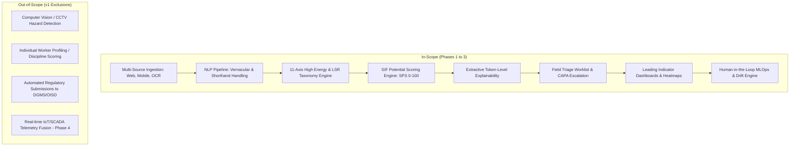
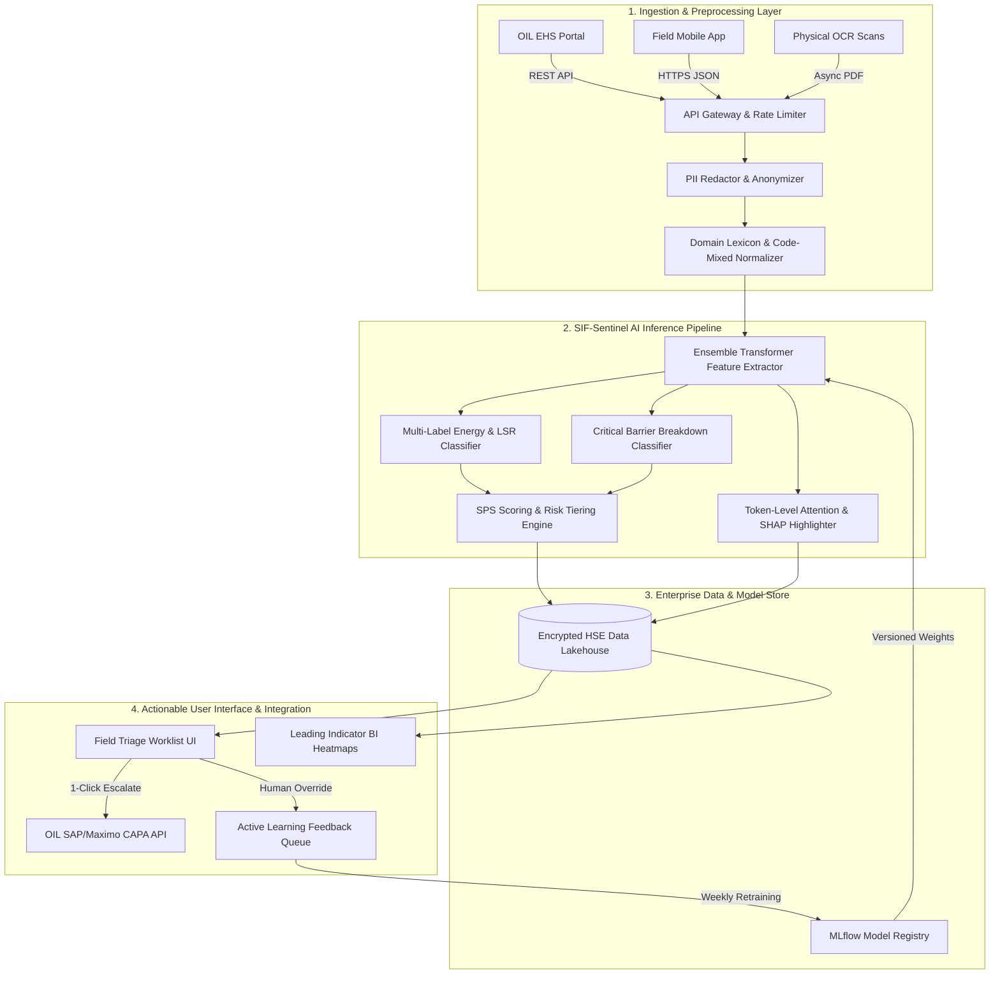
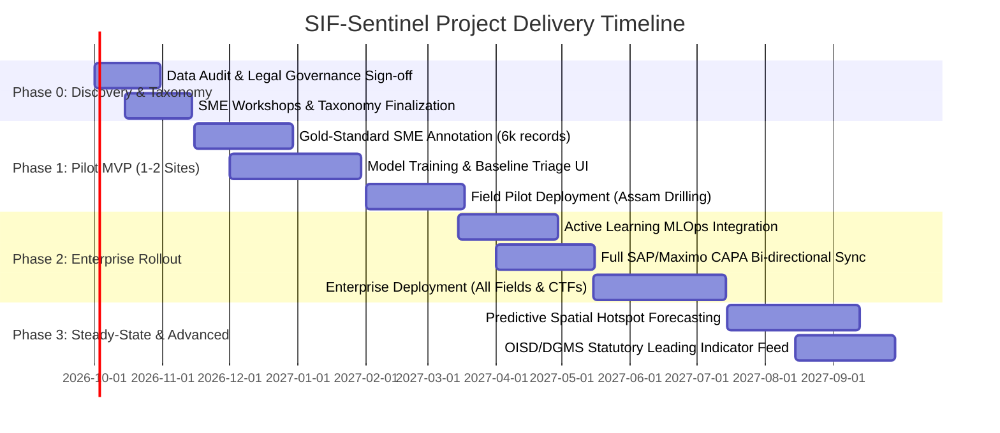

# Product Development Requirement Document (PRD)
## AI/NLP Engine for Detection of Serious Injury & Fatality (SIF) Precursors in Unsafe-Act, Unsafe-Condition, and Near-Miss Reports

---

### Document Control & Metadata

| Field | Detail |
| :--- | :--- |
| **Document ID** | 26165-PRD-SIF-NLP-01 |
| **Product Name** | SIF Precursor Intelligence Engine (Working Title: **SIF-Sentinel**) |
| **Target Organization** | Oil India Limited (OIL) — Corporate HSE & Upstream/Midstream Asset Operations |
| **Document Owner** | Lead Product Manager & HSE Digital Solutions Architect |
| **Current Version** | 1.0 (Comprehensive Baseline Release) |
| **Release Status** | Ready for Stakeholder Review & Baseline Approval |
| **Classification** | Internal — HSE Strategic & Operational Safety Sensitive |
| **Date of Baseline** | September 2026 |

---

## 1. Executive Summary

Oil India Limited (OIL) generates a continuous, high-volume stream of unstructured safety observation records across upstream exploration, drilling rigs, well services, field production installations, Gas Gathering Stations (GGS), Central Tank Farms (CTF), crude/gas pipelines, and processing facilities. These records comprise **Unsafe Act Reports (UAR)**, **Unsafe Condition Reports (UCR)**, and **Near-Miss (NM) Reports** logged via mobile reporting applications, enterprise EHS portals, permit-to-work (PTW) logs, and physical site registers.

Safety science research—grounded in the **DuPont Bradley Curve**, **Campbell Institute SIF Research**, **Dr. Fred Manuele’s Severity Decoupling Principles**, and **API RP 754 Leading Indicators**—demonstrates that 90%+ of all safety observations describe minor, low-consequence events that will never escalate to a life-altering outcome. Conversely, a critical 5% to 10% subset contains **SIF Precursors**: uncontrolled high-energy hazards or critical barrier breakdowns that, under slightly different circumstances (timing, proximity, wind direction), would result in a fatality or permanent disability.

Conventional safety triage in energy enterprises operates under a severe flaw: records are categorized and prioritized based on **actual recorded outcome** (e.g., "no injury", "minor cut", "near miss") rather than **potential consequence**. Consequently, high-potential precursor events are routinely closed as low priority by field personnel, masking systemic threats until a catastrophic incident occurs.

**SIF-Sentinel** is an enterprise-grade, domain-specialized AI/NLP intelligence engine engineered to solve this challenge. It ingests multi-lingual, code-mixed (English, Hindi, Assamese, and technical shorthand) safety reports, evaluates the presence of uncontrolled high-energy sources and critical barrier failures, computes an objective **SIF Potential Score (SPS: 0–100)**, extracts transparent explainability rationales, and delivers real-time prioritized triage queues, CAPA escalations, and predictive leading-indicator analytics to HSE leadership.

---

## 2. Problem Statement & Operational Context

### 2.1 Current Operational Baseline
1. **High Volume, Unstructured Data**: OIL HSE officers receive tens of thousands of safety narrative submissions annually. Over 75% of the operational insight is trapped within free-text narrative descriptions written in varying linguistic registers, field shorthand (e.g., *“SIMOPS at rig floor, PTW not signed, tagline snapped”*), and transliterated vernacular.
2. **Lagging Severity Bias (Outcome-Centric Triage)**: Triage is currently governed by what *actually happened*. A near-miss where a 2-ton drill pipe swung inches from a roughneck's head is categorized as "Near Miss – No Damage" and handled with routine priority, while a trip over an office cable resulting in a sprain receives high administrative attention due to lost work time.
3. **Manual, Inconsistent & Retrospective Review**: HSE field supervisors review reports manually. Due to operational workload at rigs and production installations, reviews are delayed, subjective, and prone to alert fatigue. High-precursor events are frequently closed on-site without corporate visibility.
4. **Descriptive, Not Predictive, Safety Analytics**: Monthly and quarterly HSE dashboards present descriptive lagging indicators (LTIFR, TRIR) and simple categorical counts (e.g., "PPE violations: 45"). They fail to track energy-barrier degradation, repeat precursor recurrence, or leading precursor rates by asset and contractor.

### 2.2 Core Business & Safety Problem
OIL’s corporate leadership requires an automated, validated, and auditable system to separate high-energy precursor signals from low-risk operational noise. Without automated precursor intelligence, OIL faces:
- Unmitigated risk of preventable fatalities and major process safety incidents.
- Sub-optimal allocation of limited field safety audits, senior inspection hours, and CAPA investments.
- Vulnerability during statutory regulatory scrutiny (DGMS, OISD, PESO/PNGRB) due to lack of formalized leading-indicator tracking.

### 2.3 Strategic Timing & Feasibility
- **Data Availability**: Enterprise digitization has produced 3–5+ years of historical safety records suitable for transfer learning and domain-specific LLM fine-tuning.
- **Regulatory Direction**: OISD and DGMS directives increasingly emphasize proactive barrier management, leading indicators, and digital safety surveillance.
- **AI/NLP Maturity**: Advanced transformer architectures combined with extractive explainability (token-level attribution) enable reliable, explainable decision support without "black-box" risk.

---

## 3. Goals, Non-Goals & Business Success Criteria

### 3.1 Product Goals
- **G1 — Automated Precursor Detection**: Ingest 100% of UAR/UCR/NM reports and detect SIF precursors with $\ge 90\%$ recall on true high-potential events.
- **G2 — Explainable SIF Potential Scoring (SPS)**: Generate a deterministic, transparent risk score (0–100) and risk tier (Critical, High, Medium, Low) for every report within 5 seconds of ingestion.
- **G3 — Multi-Dimensional Taxonomy Tagging**: Auto-tag narratives against an 11-category High-Energy Source taxonomy, 9 Life-Saving Rules (LSR), and 5 Critical Barrier Failure modes.
- **G4 — Intelligent Field Triage & CAPA Escalation**: Provide field HSE supervisors with an auto-prioritized triage queue that flags unreviewed Critical/High SPS reports and enables 1-click CAPA escalation.
- **G5 — Leading-Indicator Analytics & Hotspot Forecasting**: Deliver interactive dashboards tracking precursor velocity, energy-hazard concentrations, barrier degradation trends, and contractor precursor profiles.
- **G6 — Human-in-the-Loop MLOps Governance**: Capture every supervisor agree/override decision with audit trails to fuel continuous, drift-resilient active learning.

### 3.2 Non-Goals (Explicitly Out of Scope for v1)
- **NG1**: Automated generation or submission of statutory regulatory incident reports to DGMS/OISD (human legal sign-off remains mandatory).
- **NG2**: Individual worker behavioral profiling, disciplinary scoring, or punitive tracking (violates non-punitive safety charter).
- **NG3**: Computer vision/video surveillance hazard detection (reserved for Phase 4).
- **NG4**: Replacing Root Cause Analysis (RCA) or human safety investigation teams.

### 3.3 Business Success Criteria

```
+-----------------------------------------------------------------------------------+
|                            TARGET BUSINESS OUTCOMES                               |
+------------------------------------+----------------------------------------------+
| Metric                             | Baseline vs Target                           |
+------------------------------------+----------------------------------------------+
| High-Precursor Detection Recall    | Baseline: ~35% (manual) -> Target: >= 90%    |
| Triage Review Time per Report      | Baseline: 8-12 mins     -> Target: <= 2 mins |
| High-SPS CAPA Escalation SLA       | Baseline: 7-14 days     -> Target: < 24 hrs  |
| Leading Indicator Board Reporting  | Baseline: 0%            -> Target: 100%      |
+------------------------------------+----------------------------------------------+
```

---

## 4. Stakeholder Matrix & User Personas

### 4.1 Stakeholder Matrix

| Stakeholder Group | Primary Role in Product | Core Needs & Success Drivers |
| :--- | :--- | :--- |
| **Executive / Corporate CSO** | Executive Sponsor | Board-level leading-indicator metrics, OISD/DGMS audit compliance, enterprise risk heatmaps. |
| **Field HSE Officer / Supervisor** | Primary Daily User | High-speed, prioritized daily triage queue; transparent evidence highlighting; zero false-alarm clutter. |
| **Installation / Rig Manager** | Operational User | Real-time asset hazard profile, open precursor CAPAs, contractor safety performance. |
| **Process Safety / PSM Specialist** | Analytical Specialist | Energy-barrier failure correlation, HAZOP/RBI alignment, high-pressure release tracking. |
| **Contractor Safety Manager** | Collaborative User | Contractor-specific precursor trends, targeted toolbox talk insights, compliance visibility. |
| **Corporate IT & Information Security** | Technical Gatekeeper | Data residency, SSO integration, role-based access control (RBAC), on-premise/hybrid cloud compliance. |
| **MLOps / Data Science Team** | Model Custodian | Model registry, data/concept drift monitoring, automated retraining pipelines, explainability audits. |
| **Workmen & Field Unions** | Safety Culture Partner | Ironclad guarantee of non-punitive reporting; assurance that AI does not profile individuals. |

### 4.2 Detailed User Personas

#### Persona 1: Priya Sharma — Field HSE Officer (Drilling Operations, Duliajan / Upper Assam)
- **Context**: Responsible for 6 active drilling rigs and 4 workover wells. Reviews 60–100 safety observation submissions weekly.
- **Pain Points**: Overwhelmed by low-value reports (e.g., "trash can full"); spends hours manually reading narratives to find the 3 high-risk well-control or dropped-object near-misses.
- **Goal in SIF-Sentinel**: Open the app each morning, see the top 5 high-potential reports immediately at the top of the queue with key hazard sentences highlighted in red, verify the AI classification in under 60 seconds, and trigger an immediate CAPA ticket to the Rig Toolpusher.

#### Persona 2: Er. Rakesh Borah — Asset Manager (Central Tank Farm & GGS)
- **Context**: Oversees crude processing, storage tanks, and high-pressure gas gathering pipelines.
- **Pain Points**: Lacks real-time visibility into whether pipe-fitting contractors are consistently violating hot-work isolation permits across multiple shifts.
- **Goal in SIF-Sentinel**: Review the weekly Precursor Heatmap showing "Stored Energy / Pressurized Lines" spikes during SIMOPS operations, allowing him to intervene with contractor leadership before an explosion or blowout occurs.

#### Persona 3: Dr. S. Iyer — Chief General Manager (Process Safety & Risk Engineering)
- **Context**: Leads corporate safety audits, HAZOP re-evaluations, and OISD-154 compliance across all installations.
- **Pain Points**: Historical safety records are siloed; cannot easily correlate near-miss barrier breakdowns with Major Accident Hazard (MAH) scenarios.
- **Goal in SIF-Sentinel**: Run cross-asset queries on "Critical Barrier: Ignition Source Control Failure" to benchmark installation barrier integrity and guide Risk-Based Inspection (RBI) schedules.

---

## 5. Scope & Product Boundary



---

## 6. SIF Precursor Taxonomy & Core Domain Model

The classification backbone maps every observation against an industry-standard, oil & gas specialized taxonomy validated against OISD-STD-112, OISD-STD-154, and API RP 754.

### 6.1 High-Energy Source Categories (Primary Risk Dimension)

```
+----+------------------------------------+---------------------------------------------------------------+
| ID | Energy Source Category             | Specific Operational Hazard Manifestations in Oil & Gas       |
+----+------------------------------------+---------------------------------------------------------------+
| E1 | Gravity & Suspended Loads          | Dropped drill collars, crane hoisting, falls from derrick/mast |
| E2 | Mechanical & Moving Machinery      | Rotary table entanglements, pump jack pinch points, drawworks |
| E3 | Pressurized Fluids & Gases (Piping)| High-pressure mud lines, steam leaks, pig launcher kickbacks  |
| E4 | Electrical & Static Hazard         | High-voltage switchgear, ungrounded fuel transfer, arc flash  |
| E5 | Process Hydrocarbon Release        | Gas leak at GGS manifold, well kick, condensate flange seep   |
| E6 | Thermal / Cryogenic Energy         | Flare line contact, steam boiler burns, hot oil lines        |
| E7 | Hazardous Chemical & H2S Toxic Gas | H2S sour gas pocket, acidizing chemical splash, drilling mud  |
| E8 | Confined Space & Toxic Atmosphere  | Tank interior inspection, mud pit entry, valve pit asphyxiation|
| E9 | Vehicle & Heavy Mobile Equipment   | Frac truck rollover, forklift pedestrian strike, pipeline ROW |
| E10| Excavation & Ground Collapse       | Pipeline trench wall collapse, rig matting soil subsidence    |
| E11| Marine & Riverine Water Hazard     | Brahmaputra river crossing barge ops, marsh rig boat transfer |
+----+------------------------------------+---------------------------------------------------------------+
```

### 6.2 Life-Saving Rules (LSR) & Critical Control Linkage

Every report is multi-label mapped to OIL’s Life-Saving Rules:
1. **LSR-01**: Work Authorization & Permit to Work (PTW) Compliance
2. **LSR-02**: Energy Isolation & Lockout-Tagout (LOTO)
3. **LSR-03**: Line of Fire & Stored Energy Release Avoidance
4. **LSR-04**: Working at Height & 100% Tie-Off Protection
5. **LSR-05**: Confined Space Entry & Atmospheric Testing
6. **LSR-06**: Hot Work & Ignition Source Control in Zone 0/1/2
7. **LSR-07**: Safe Mechanical Lifting & Exclusion Zones
8. **LSR-08**: Driving Safety, Journey Management & Seatbelt Use
9. **LSR-09**: Well Control & Process Safety Barrier Integrity

### 6.3 Critical Barrier Failure Modes
The NLP model explicitly extracts and tags the barrier status:
- **B-1 [Missing Barrier]**: Required control was never instituted (e.g., *“No gas test performed before hot cut”*).
- **B-2 [Defeated/Bypassed Barrier]**: Safety interlock or guard deliberately overridden (e.g., *“High-level ESD bypassed with wire”*).
- **B-3 [Damaged/Degraded Barrier]**: Physical barrier worn or defective (e.g., *“Worn brake lining on drawworks”*).
- **B-4 [Administrative Breakdown]**: Inadequate supervision, expired PTW, uncertified rigger.

### 6.4 SIF Potential Score (SPS) Formulation

The SIF Potential Score is calculated on a normalized scale of $0 \text{ to } 100$:

$$\text{SPS} = \min\left(100, \, \left[ \left( W_{\text{energy}} \cdot S_{\text{energy}} \right) + \left( W_{\text{barrier}} \cdot S_{\text{barrier}} \right) + \left( W_{\text{exposure}} \cdot S_{\text{exposure}} \right) \right] \times M_{\text{context}} \right)$$

Where:
- $S_{\text{energy}} \in [0, 10]$: Energy magnitude score derived from NLP detection of energy source category.
- $S_{\text{barrier}} \in [0, 10]$: Barrier failure severity (absence/defeat of life-critical barrier scores 10).
- $S_{\text{exposure}} \in [0, 10]$: Line-of-fire proximity, worker density, or narrow escape margin.
- $W_{\text{energy}} = 4.0, \, W_{\text{barrier}} = 3.5, \, W_{\text{exposure}} = 2.5$ (Base weighting coefficients).
- $M_{\text{context}} \in [1.0, 1.3]$: Contextual multiplier based on high-hazard activity type (e.g., SIMOPS, Live Well Intervention).

#### SPS Risk Tier Stratification
- **Critical (SPS 80–100)**: Immediate fatal potential. Uncontrolled high energy with total barrier absence or near-miss narrow escape. Mandates $\le 4 \text{ hr}$ supervisor review and 24 hr CAPA escalation.
- **High (SPS 60–79)**: High-energy hazard present with single degraded barrier or repeat systemic violation. Mandates $\le 24 \text{ hr}$ review.
- **Medium (SPS 30–59)**: Moderate energy hazard or administrative compliance gap with secondary safeguards intact. Mandates $\le 7 \text{ day}$ review.
- **Low (SPS 0–29)**: Low-consequence housekeeping, ergonomics, or minor PPE non-compliance without high-energy exposure. Handled via bulk review.

---

## 7. Detailed Functional Requirements

### Module FR-1: Multi-Source Data Ingestion & ETL
- **FR-1.1 Automated REST API Ingestion**: Provide secure, authenticated endpoints to ingest structured JSON payloads and unstructured text from OIL's enterprise EHS applications, mobile safety apps, and electronic PTW systems within 60 seconds of submission.
- **FR-1.2 Batch Ingestion Pipeline**: Ingest legacy historical archives (CSV, Excel, SQL dumps) supporting datasets $\ge 500,000$ records with automated validation checks.
- **FR-1.3 OCR Preprocessing Engine**: Ingest scanned physical safety observation cards and PDF inspection logs using an embedded OCR engine with spell-correction tuned for handwritten and low-contrast field documents.
- **FR-1.4 Data Lineage & Immutable Hashing**: Generate a SHA-256 hash for every ingested record, capturing source timestamp, asset ID, reporter organization, and original unaltered text.

### Module FR-2: Domain-Adapted NLP & Vernacular Preprocessing
- **FR-2.1 Oil & Gas Lexicon Normalization**: Expand domain-specific technical acronyms, drilling jargon, and abbreviations (e.g., `BOP`, `PDC bit`, `DST`, `GGS`, `CTF`, `H2S`, `PTW`, `LOTO`, `SIMOPS`, `ESD`, `DP`, `DC`).
- **FR-2.2 Multilingual & Code-Mixed Handling**: Process code-mixed inputs featuring Hindi, Assamese, and Bengali transliterated into Latin script (e.g., *“Rig floor pe pipe slip ho gaya, worker bach gaya”*). Support dual-track handling via multilingual embeddings and localized translation normalization.
- **FR-2.3 Named Entity Recognition (NER)**: Extract custom entities including Equipment Tag (`EQP-PUMP-04`), Location/Installation (`GGS-Moran-3`), Activity (`Casing Running`), and Hazard Agent (`Hydrocarbon Condensate`).
- **FR-2.4 PII Redaction & Non-Punitive Scrubbing**: Automatically detect and mask employee names, gate pass numbers, and personal identifiers before storage and model scoring to guarantee non-punitive governance.

### Module FR-3: Multi-Label Classification, Scoring & Explainability
- **FR-3.1 Multi-Label Taxonomy Classification**: Tag every narrative against the 11 High-Energy categories and 9 Life-Saving Rules with class-level confidence probabilities ($P \in [0.0, 1.0]$).
- **FR-3.2 SPS Risk Scoring**: Compute the 0–100 SIF Potential Score and assign the corresponding tier (Critical, High, Medium, Low) based on the multi-factor scoring model.
- **FR-3.3 Token-Level Extractive Explainability**: Identify and return the exact text spans and tokens driving the classification (e.g., *“[crane wire frayed] [swinging over active manifold]”*), returning start/end character offsets for UI highlighting.
- **FR-3.4 Dynamic Threshold Calibration**: Enable authorized HSE administrators to calibrate confidence cutoffs and SPS weighting coefficients per asset type without redeploying code.

### Module FR-4: Field HSE Triage Worklist & CAPA Escalation
- **FR-4.1 Real-Time Prioritized Queue**: Render a dynamic worklist sorted by SPS (descending) with filtering by Asset, Installation, Date, Energy Source, and Review Status.
- **FR-4.2 One-Click CAPA Ticket Generation**: Allow HSE supervisors to convert a Critical/High SPS observation into an official CAPA ticket, auto-populating hazard category, highlighted evidence, and suggested corrective controls.
- **FR-4.3 Human Override & Feedback Loop**: Enable supervisors to agree, disagree, or adjust AI classifications and SPS tiers. Mandatory capture of structured reason codes (e.g., *“Contextual safeguard existed: blast wall present”*) to populate the active learning retraining queue.
- **FR-4.4 SLA Escalation & Aging Alerts**: Trigger automated visual and email/SMS alerts if a Critical SPS report remains unreviewed after 4 hours or a High SPS report exceeds 24 hours.
- **FR-4.5 Low-Risk Bulk Triage**: Provide a batch review mode for Low SPS records ($<30$) to allow supervisors to verify and close routine observations in under 10 seconds.

### Module FR-5: Leading-Indicator Analytics & Executive BI
- **FR-5.1 Dynamic Precursor Velocity & Rate**: Display real-time precursor rates (Precursor Reports per 10,000 Observation Hours) by asset, rig, and operating division.
- **FR-5.2 Energy-Hazard Matrix Heatmap**: Interactive multi-dimensional heatmap plotting Installations vs. High-Energy Categories to highlight systemic exposure clusters.
- **FR-5.3 Leading vs. Lagging Indicator Correlation**: Correlate precursor velocity against historical incident records (TRIR/LTIFR) to empirically validate the predictive power of precursor intelligence.
- **FR-5.4 Board & Regulatory Export Engine**: Generate automated, audit-ready PDF/Excel executive summaries aligned with OISD-154 and DGMS safety review templates.

### Module FR-6: MLOps, Governance & Continuous Retraining
- **FR-6.1 Model Registry & Version Tracking**: Maintain a formal registry where every production classification is permanently linked to an immutable Model Version ID (`v1.4.2-oil-transformer`).
- **FR-6.2 Data Drift & Concept Drift Surveillance**: Continuously monitor distribution shifts in input vocabulary, confidence scores, and supervisor override rates, triggering automated retraining alerts when drift exceeds defined statistical bounds.
- **FR-6.3 Active Learning Retraining Pipeline**: Automate the weekly extraction of supervisor-verified and overridden records into a staged fine-tuning pipeline with automated validation against a gold-standard benchmark set.
- **FR-6.4 Shadow Deployment & Rollback**: Support zero-downtime canary/shadow deployments of updated models alongside 1-click rollback capabilities.

### Module FR-7: System Administration, RBAC & Audit Trails
- **FR-7.1 Role-Based Access Control (RBAC)**: Support 6 granular roles: *Super Admin, Corporate HSE Lead, Field HSE Officer, Asset Manager, Process Safety Analyst, MLOps Engineer*.
- **FR-7.2 Taxonomy Version Management**: Provide a UI console to introduce new Life-Saving Rules or hazard categories with versioned backwards-compatibility.
- **FR-7.3 Immutable Audit Logging**: Maintain a cryptographically verifiable log of all logins, record views, classification overrides, threshold changes, and CAPA escalations for $\ge 7\text{ years}$.

### Module FR-8: Enterprise Integration Architecture
- **FR-8.1 Bi-Directional CAPA Integration**: Integrate with OIL's SAP/Maximo or bespoke CAPA system for status synchronization (Open $\rightarrow$ In-Progress $\rightarrow$ Verified $\rightarrow$ Closed).
- **FR-8.2 Corporate SSO Integration**: Integrate with OIL's Active Directory / SAML 2.0 / OAuth2 identity providers supporting Multi-Factor Authentication (MFA).
- **FR-8.3 BI Embedding Hooks**: Expose secured OData and REST endpoints for direct visualization within enterprise Microsoft Power BI dashboards.

---

## 8. Non-Functional Requirements (NFR)

```
+-----------------------------------------------------------------------------------------------+
|                               NON-FUNCTIONAL SPECIFICATIONS                                   |
+----------------------+------------------------------------------------------------------------+
| Dimension            | Technical Specification & SLA Target                                   |
+----------------------+------------------------------------------------------------------------+
| Classification Speed | Real-time inference <= 2.5 seconds (p95); batch throughput >= 2,500    |
|                      | records/minute on dedicated compute nodes.                             |
| Platform Scalability | Support horizontal scaling to handle 10x current daily volume (up to   |
|                      | 50,000 reports/day during intensive drilling campaigns).               |
| System Availability  | 99.5% operational uptime; scheduled maintenance restricted to off-peak.|
| Model Accuracy SLA   | Recall on true SIF precursors >= 90%; Precision >= 72%; ROC-AUC >= 0.88|
| Data Residency       | 100% data residency within India (OIL on-premise datacenter or MeitY- |
|                      | empaneled private sovereign cloud). Zero data transmission to external.|
| Information Security | AES-256 encryption for data at rest; TLS 1.3 for data in transit;      |
|                      | compliance with CERT-In and Indian DPDP Act 2023.                      |
| Usability & UX       | Zero user training required for basic triage; <= 3 clicks to execute   |
|                      | any workflow; responsive design across rugged tablets and desktops.    |
| Offline Capability   | Progressive Web App (PWA) client with local encrypted SQLite cache for |
|                      | offline field triage on remote drilling rigs with auto-sync.           |
+----------------------+------------------------------------------------------------------------+
```

---

## 9. Data Requirements, Annotation Strategy & Ground Truth

### 9.1 Data Corpus Composition
- **Historical Report Archive**: $150,000+$ historical UAR, UCR, and Near-Miss reports spanning 2018–2025 across all OIL operating spheres (Assam & Assam Arakan Basin, Rajasthan, KG Basin, Pipeline HQ).
- **Historical Incident & RCA Logs**: Comprehensive Root Cause Analysis dossiers from all past Major/Minor Lost Time Incidents (LTI) and Dangerous Occurrences to establish empirical ground truth.
- **Master Metadata Catalogs**: Asset hierarchy tables, well master logs, contractor registries, and operational shift rosters.

### 9.2 Annotation Protocol & SME Labeling
- **Gold-Standard Sample Size**: A statistically stratified sample of 6,000 historical reports will be double-blind annotated by a joint panel of certified HSE Officers and Process Safety Engineers.
- **Inter-Annotator Agreement (IAA)**: Measured via **Cohen’s Kappa ($\kappa$)** across taxonomy axes. Annotation guidelines will be iteratively refined until $\kappa \ge 0.82$ across all critical categories.
- **Discrepancy Adjudication**: Any report where annotators disagree on SIF potential will be reviewed and finalized by the Chief General Manager (HSE).

---

## 10. AI/ML Architecture & System Design

### 10.1 High-Level End-to-End System Topology



### 10.2 Modeling Methodology
1. **Hybrid Architecture**: Combines domain rule heuristics (high-precision safety triggers) with an ensemble of fine-tuned transformer encoders (Domain-adapted RoBERTa / IndicBERT fine-tuned on oil & gas safety narratives).
2. **Extractive Rationalization**: Implements attention-weight mapping and token-level gradient attribution to extract the top-3 driving phrases per classification with zero inference latency overhead.
3. **Multi-Task Objective Function**: Jointly optimizes multi-label taxonomy loss (binary cross-entropy) and SPS regression loss (mean squared error) to enforce shared safety representation.

---

## 11. Ethics, Non-Punitive Culture & Trust Framework

Safety observation reporting collapses when field workers fear disciplinary action. SIF-Sentinel embeds the following non-negotiable principles:

```
+-----------------------------------------------------------------------------------------------+
|                              NON-PUNITIVE ETHICAL CHARTER                                     |
+----+----------------------------+-------------------------------------------------------------+
| #  | Core Principle             | Technical & Governance Enforcement Rule                     |
+----+----------------------------+-------------------------------------------------------------+
| E1 | Zero Individual Profiling  | The system strictly prohibits and prevents worker-level      |
|    |                            | scoring, rankings, or disciplinary tracking.                |
| E2 | Automated PII Masking      | Worker names and IDs are cryptographically hashed and       |
|    |                            | redacted before AI feature extraction.                      |
| E3 | Systemic Focus             | High SPS scores signify systemic, environmental, or process |
|    |                            | risks—never personal worker culpability.                    |
| E4 | Human Primacy (HITL)       | AI outputs are recommendations; field HSE supervisors hold  |
|    |                            | full authority to override, calibrate, or discard scores.   |
| E5 | Algorithmic Fairness Audit | Quarterly statistical audits to prevent systematic bias     |
|    |                            | against specific regional dialects or contractor firms.     |
+----+----------------------------+-------------------------------------------------------------+
```

---

## 12. Indian Regulatory & Industry Standards Compliance

The solution is mapped directly to Indian statutory frameworks governing upstream oil & gas:
- **Directorate General of Mines Safety (DGMS)**: Compliance with Mines Act 1952, Oil Mines Regulations (OMR 2017) regarding dangerous occurrences and proactive risk assessments.
- **Oil Industry Safety Directorate (OISD)**:
  - *OISD-STD-112*: Safe handling of hazardous chemicals and H2S monitoring.
  - *OISD-STD-154*: Safety management systems, leading safety performance indicators, and barrier health verification.
  - *OISD-GDN-206*: Process Safety Management (PSM) leading metrics.
- **Petroleum & Explosives Safety Organization (PESO)**: Hazardous area zone classifications and permit-to-work rigor.
- **Digital Personal Data Protection Act (DPDP 2023)**: Complete data minimization and sovereign localized data storage.

---

## 13. Success Metrics & Key Performance Indicators (KPIs)

```
+-----------------------------------------------------------------------------------------------+
|                                      PROGRAM KPIS                                             |
+----+--------------------------------+----------------------------+----------------------------+
| #  | Performance Dimension          | Target Metric              | Validation Methodology     |
+----+--------------------------------+----------------------------+----------------------------+
| K1 | SIF Precursor Recall           | >= 90.0%                   | Validated against blind    |
|    |                                |                            | RCA incident dataset       |
| K2 | SIF Precursor Precision        | >= 72.0%                   | HSE supervisor acceptance  |
| K3 | Daily Triage Time Efficiency   | >= 50% reduction in review | Time-motion study on pilot |
|    |                                | hours per officer          | rigs and installations     |
| K4 | Critical Report Escalation SLA | 98% escalated in < 12 hrs  | Automated audit log clock  |
| K5 | Precursor-to-CAPA Closure Rate | >= 92% closed within SLA   | SAP/Maximo bi-directional  |
|    |                                |                            | sync tracking              |
| K6 | Model Concept Stability        | Monthly F1 variance < 3.5% | MLOps drift dashboard      |
| K7 | User Trust & Satisfaction      | >= 85% System Usability    | Quarterly blind Likert-    |
|    |                                | Score (SUS >= 80)          | scale supervisor surveys   |
+----+--------------------------------+----------------------------+----------------------------+
```

---

## 14. Phased Implementation Roadmap



---

## 15. Risk Management Matrix

| Risk Scenario | Risk Severity | Likelihood | Impact on Project | Mitigating Strategy & Safeguards |
| :--- | :---: | :---: | :--- | :--- |
| **Historical Data Label Noise** | High | High | Degraded initial model accuracy and precision. | Execute dedicated 6,000-record double-blind SME annotation campaign with Cohen’s Kappa validation before training. |
| **Worker Fear of AI Surveillance** | Critical | Med | Drop in safety reporting volume across field rigs. | Promulgate executive-signed Non-Punitive Charter; mask all PII before processing; engage worker unions in Phase 0. |
| **Field Officer Alert Fatigue** | High | Med | Supervisors ignore flagged reports due to false alarms. | Dynamic confidence thresholding; batch low-risk review mode; prioritize high-precision tuning for notifications. |
| **High Vernacular Language Variance** | Med | High | Missed precursors in code-mixed Assamese/Hindi text. | Incorporate IndicBERT multilingual embeddings fine-tuned on local oilfield phraseology and colloquialisms. |
| **Enterprise IT Integration Delays** | Med | Med | Delayed ingestion from legacy on-premise systems. | Deploy decoupled REST API gateway with CSV/Excel automated folder watchdogs as interim ingestion fallback. |

---

## 16. Stakeholder Questionnaire & Discovery Checklist

*To be completed during Phase 0 Kickoff with OIL Technical & HSE Teams:*

1. **Source System Architecture**: What are the exact software packages, database versions, and API capabilities of OIL's current incident/observation systems?
2. **Historical Data Access**: Can OIL provide extract access to 5 years of historical UAR/UCR/NM and RCA records within 14 days of project initiation?
3. **Life-Saving Rules Mapping**: Are OIL’s Golden Rules / Life-Saving Rules formally documented with detailed sub-clauses, or is alignment required during SME workshops?
4. **Hosting & Infrastructure**: Is the deployment targeted for OIL’s on-premise datacenter (e.g., Duliajan/Noida) or an empaneled sovereign cloud (e.g., NIC/AWS GovCloud)?
5. **Hardware Availability**: Are GPU compute nodes (e.g., NVIDIA A100/L40S) available for on-premise model training and low-latency inference?
6. **CAPA Target System**: What system serves as the master database for corrective actions (SAP PM, Maximo, or a custom portal)?
7. **Pilot Site Identification**: Which specific drilling field (e.g., Greater Dibrugarh Asset) and processing plant (e.g., Moran CTF) are designated for Phase 1 pilot deployment?

---

## 17. Pilot Acceptance Criteria (Definition of Done)

The Phase 1 Pilot will be declared successfully completed when:
1. **Taxonomy Sign-Off**: The SIF Precursor Taxonomy is formally approved in writing by the Corporate HSE Committee.
2. **Model Validation**: The AI model demonstrates $\ge 90\%$ Recall and $\ge 70\%$ Precision on the blind test dataset of 1,000 un-seen historical records.
3. **Zero Black-Box Output**: 100% of classified reports display highlighted evidence spans in the UI explaining the assigned score.
4. **End-to-End Workflow**: Pilot HSE officers successfully triage 100% of daily incoming reports and trigger verified CAPA tickets into the test CAPA system.
5. **Security & Data Privacy Audit**: Successful vulnerability assessment and penetration testing (VAPT) and sign-off on PII scrubbing compliance by OIL Corporate IT Security.
6. **Field Adoption**: $\ge 80\%$ positive usability approval in the pilot HSE officer retrospective.

---

## 18. Application Navigation & Detailed User Workflows

```
+===============================================================================================+
|                     SIF-SENTINEL ENTERPRISE INFORMATION ARCHITECTURE                          |
+===============================================================================================+
|                                                                                               |
| [1.0 Home / Dashboard]  ---> Real-time Precursor Pulse, SLA Alerts, Today's Triage Summary    |
| [2.0 Triage Worklist]   ---> Split-screen prioritized queue, multi-filter, batch triage       |
| [3.0 Report Detail]     ---> Narrative viewer, token highlighting, SPS breakdown, audit trail |
| [4.0 Leading BI]        ---> Hazard matrix heatmaps, barrier degradation, contractor trends   |
| [5.0 CAPA Tracker]      ---> Escalation tickets, lifecycle status, SLA aging, verification    |
| [6.0 Administration]    ---> Taxonomy manager, threshold calibration, RBAC, audit log viewer |
| [7.0 Notifications]     ---> Real-time critical SLA countdowns, override dispute alerts       |
| [8.0 Help & Docs]       ---> Interactive tour, taxonomy definitions, non-punitive charter     |
+===============================================================================================+
```

### 18.1 Navigation Philosophy & Layout Structure

The user interface follows an ergonomic, high-efficiency information design tailored for fast decision-making in demanding industrial environments:
1. **Role-Tailored Landing**:
   - *Field HSE Officers* land directly on the **Triage Worklist (2.0)** with their assigned installation pre-filtered.
   - *Installation & Asset Managers* land on the **Operational Leading Dashboard (4.0)**.
   - *Corporate Safety Leads & CSOs* land on the **Executive Precursor Overview (1.0)**.
2. **Persistent Ergonomic Navigation Rail**: A collapsible, icon-and-label vertical navigation rail on the left edge provides 1-click access to all 8 core modules.
3. **Global Omnibox Search (`Ctrl + K`)**: Instant search across report IDs, keywords (*"gas leak Moran"*), equipment codes, or contractor names.
4. **Real-Time SLA Alert Banner**: A top-anchored, non-intrusive alert banner displaying active countdown timers for unreviewed Critical SPS reports.

---

### 18.2 Comprehensive Feature Breakdown by Module

```
+-----------------------------------------------------------------------------------------------+
|                                    MODULE FEATURE MATRIX                                      |
+----------------------+------------------------------------------------------------------------+
| Module               | Detailed Functional Capabilities                                       |
+----------------------+------------------------------------------------------------------------+
| 1.0 Executive Pulse  | - Real-time SPS gauge showing enterprise precursor velocity.           |
|                      | - Urgent SLA counter (e.g., "3 Critical Reports require action <4 hrs")|
|                      | - 24-hr Precursor vs Routine observation distribution chart.           |
|                      | - 1-click shortcut to highest-risk open report.                        |
+----------------------+------------------------------------------------------------------------+
| 2.0 Triage Worklist  | - Priority-ranked table sorted by SPS score (descending).              |
|                      | - Color-coded risk badges: [CRITICAL: 92] [HIGH: 74] [MED: 45] [LOW:18]|
|                      | - Quick-filter chips: Asset, Rig, Life-Saving Rule, High-Energy Type.  |
|                      | - Split-screen inspection drawer (review without losing list context). |
|                      | - Bulk-select toolbar for 1-click batch verification of Low SPS items. |
+----------------------+------------------------------------------------------------------------+
| 3.0 Report Detail &  | - Synchronized dual-pane view: Original report vs AI Risk Analysis.   |
|     Evidence Viewer  | - Extractive token highlighting: Visual red/yellow spans over keywords.|
|                      | - SPS mathematical breakdown card showing energy/barrier weights.      |
|                      | - One-click supervisor action buttons: [Confirm & Escalate] [Override].|
|                      | - Inline override modal capturing structured reason code & comments.   |
+----------------------+------------------------------------------------------------------------+
| 4.0 Leading BI &     | - Cross-asset Precursor Heatmap (Asset Installations vs Energy Types). |
|     Heatmap Studio   | - Barrier Degradation Trends: Tracking repeat missing/defeated guards. |
|                      | - Contractor Precursor Index: Risk-normalized contractor comparisons.  |
|                      | - OISD/DGMS export studio: 1-click board-ready PDF generation.         |
+----------------------+------------------------------------------------------------------------+
| 5.0 CAPA Escalation  | - Kanban board & table view of all precursor-generated CAPA tickets.  |
|     Tracker          | - Real-time sync status with SAP PM / Maximo work orders.              |
|                      | - Escalation aging clocks with automatic supervisor reminders.         |
|                      | - Digital verification sign-off with photo/evidence attachment.        |
+----------------------+------------------------------------------------------------------------+
| 6.0 Administration & | - Visual Taxonomy Editor: Add/modify Life-Saving Rules and energy tags.|
|     Governance       | - Threshold Calibration Sliders: Adjust asset-specific sensitivity.    |
|                      | - Role-Based User Management (RBAC) & Single Sign-On mapping.          |
|                      | - Cryptographic Audit Log Viewer with filterable event history.        |
+----------------------+------------------------------------------------------------------------+
| 7.0 Notification Hub | - Push, SMS, and in-app notifications for Critical SPS breaches.       |
|                      | - Daily digest email summarizing asset precursor statistics.           |
+----------------------+------------------------------------------------------------------------+
| 8.0 Help & Standards | - Interactive guided walkthrough tour for new HSE officers.            |
|                      | - Official OISD/DGMS regulatory cross-reference library.               |
|                      | - Executive-signed Non-Punitive Safety Culture Declaration.            |
+----------------------+------------------------------------------------------------------------+
```

---

### 18.3 Step-by-Step Operational User Workflows

#### Workflow A: Daily Field HSE Officer Morning Triage
```
[1. User Login] -> [2. Landing on Triage Queue] -> [3. Review Critical Record]
       |                      |                                |
       v                      v                                v
Auth via OIL SSO       Filter: "My Asset"            Inspect Highlighted Text
(MFA Protected)        Sorted by SPS Descending       & SPS Risk Breakdown
                                                               |
       +-------------------------------------------------------+
       |
       v
[4. Decision Step]
       |---> Option A: AGREE ---> Click [Confirm & Escalate] ---> Auto-generate CAPA Ticket
       |                                                          (Assigns Toolpusher SLA: 24h)
       |
       |---> Option B: OVERRIDE ---> Click [Adjust Risk/Tags] ---> Select Reason Code
                                                                   (Sends to MLOps Retrain Queue)
       |
       v
[5. Batch Low-Risk Review] ---> Select all SPS < 30 ---> Click [Batch Verify] (Queue Cleared)
```

#### Workflow B: High-SPS CAPA Escalation & Verification Lifecycle
```
[High SPS Identified] ---> [Auto-Draft CAPA Ticket] ---> [Toolpusher Receives Alert]
                                    |                               |
                                    v                               v
                         Tagged: "LSR-03 Line of Fire"     Execute Field Mitigation
                         Priority: URGENT (24h SLA)        Upload Verification Photo
                                                                    |
                                                                    v
[HSE Officer Re-inspection] <--- [Submit for Closure] <-------------+
            |
            +---> If Approved: Ticket Closed & Synced to SAP PM
            +---> If Rejected: Ticket Re-opened with Escalation to Asset Manager
```

#### Workflow C: Asset / Installation Manager Leading-Indicator Trend Analysis
```
[Asset Manager Login] ---> [Navigate to 4.0 Leading BI] ---> [Select "Moran GGS Asset"]
                                                                       |
                                                                       v
[Inspect Precursor Heatmap] <--- [Drill Down into Red Cell: "Pressurized Lines (E3)"]
            |
            v
[Review 12 Associated Reports] ---> Identify Systemic Trend: "Flange gaskets failing under vibration"
            |
            v
[Initiate Proactive Asset Action] ---> Order Engineering Inspection & Issue Safety Stand-Down Notice
```

#### Workflow D: HSE Admin Taxonomy & Sensitivity Calibration
```
[Admin Login] ---> [Open 6.0 Administration] ---> [Taxonomy & Threshold Manager]
                                                               |
                                                               v
[Simulate Threshold Change] <--- [Adjust Gravity Weight: 4.0 -> 4.5 for Drilling Assets]
            |
            v
[Review Impact on Historical Backlog] (Shows +4.2% Critical Reports Flagged)
            |
            v
[Submit for Approval] ---> Requires Corporate CSO Dual-Signoff ---> Applied to Live Engine
```

#### Workflow E: MLOps Model Feedback, Drift Monitoring & Continuous Retraining
```
[Supervisor Overrides Logged] ---> [Active Learning Queue (Min 500 Samples)]
                                                   |
                                                   v
[Drift Alert Triggered] <--- [Automated Pipeline Runs Fine-Tuning & Benchmark Evaluation]
            |
            v
[Benchmark Comparison]:
  - Legacy Model: Recall 90.2%, Precision 72.1%
  - Retrained Model: Recall 92.4%, Precision 75.8%
            |
            v
[Deploy Shadow Mode] (Runs parallel for 7 days) ---> [1-Click Promotion to Production Registry]
```

#### Workflow F: Field Mobile / Low-Bandwidth Offline Sync Operation
```
[HSE Officer at Remote Rig] ---> [Open PWA on Rugged Tablet (No Cellular Signal)]
                                                |
                                                v
[Local Inference / Cached Triage] <--- [PWA Operates from Encrypted SQLite Store]
            |
            v
[Perform Triage & Log Overrides Offline]
            |
            v
[Return to Rig Base / Network Restored] ---> [Automated Background Sync to Enterprise Lakehouse]
```

---

### 18.4 UX, Interaction & Ergonomic Design Standards

1. **The 3-Click Rule**: Any operational report, metric, or CAPA ticket must be accessible in 3 clicks or fewer from any screen in the application.
2. **Keyboard Accelerators**:
   - `J` / `K`: Move to Next / Previous report in triage queue.
   - `E`: Confirm and Escalate to CAPA.
   - `O`: Open Override Modal.
   - `V`: Verify Low-Risk and Advance.
   - `Esc`: Close split-screen inspection drawer.
3. **High-Glare Outdoor Mode**: High-contrast, sunlight-readable UI theme specifically designed for field tablets operating on outdoor rig floors under direct Assam sunlight.
4. **Accessibility Compliance**: Strict adherence to **WCAG 2.1 Level AA** standards, including screen-reader compatibility and full keyboard navigability.

---

## 19. Appendix & Reference Frameworks

### 19.1 Comprehensive Glossary
- **SIF**: Serious Injury or Fatality.
- **SIF Precursor**: An unmitigated high-energy hazard or critical control breakdown that, under slightly different conditions, would have produced a fatality or life-altering injury.
- **SPS (SIF Potential Score)**: The normalized 0–100 risk score generated by the SIF-Sentinel engine.
- **UAR / UCR / NM**: Unsafe Act Report / Unsafe Condition Report / Near-Miss Report.
- **PTW**: Permit to Work.
- **LOTO**: Lockout / Tagout (Hazardous Energy Isolation).
- **SIMOPS**: Simultaneous Operations (multiple high-hazard operations in close physical proximity).
- **GGS / CTF**: Gas Gathering Station / Central Tank Farm.
- **OISD**: Oil Industry Safety Directorate (Ministry of Petroleum & Natural Gas, India).
- **DGMS**: Directorate General of Mines Safety (Ministry of Labour & Employment, India).
- **PESO**: Petroleum and Explosives Safety Organization.
- **DPDP Act**: Digital Personal Data Protection Act, 2023 (India).

### 19.2 Standard Industry Reference Frameworks
- **DuPont Sustainable Solutions / Bradley Curve Safety Maturity Model**.
- **Campbell Institute / National Safety Council (NSC)**: *Serious Injury and Fatality Prevention — Precursors and Leading Indicators*.
- **API Recommended Practice 754**: *Process Safety Performance Indicators for the Refining and Petrochemical Industries*.
- **Center for Chemical Process Safety (CCPS)**: *Guidelines for Process Safety Metrics and Risk-Based Process Safety*.

---

*End of Document — 26165-PRD-SIF-NLP-01 (Version 1.0 Baseline).*
